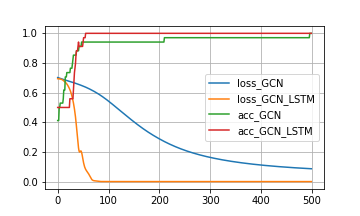

## GCN-with-LSTM (Graph Convolutional Networks with LSTM)
グラフ構造を畳み込むGCNをLSTMを使って改良する\

参照論文\
https://arxiv.org/pdf/1609.02907.pdf

GCN ではグラフを隣接行列とラプラシアン行列として表現する.
そこでで単にこれらの行列を畳み込むのではなく、、まず出力と入力\
の次元が同じLSTMにこれらの行列を通せば、よりグラフのつながりを\
表現できるのではないかと考えた。

データセットとしてはnetworkXに付属している

結果は以下のとおり

